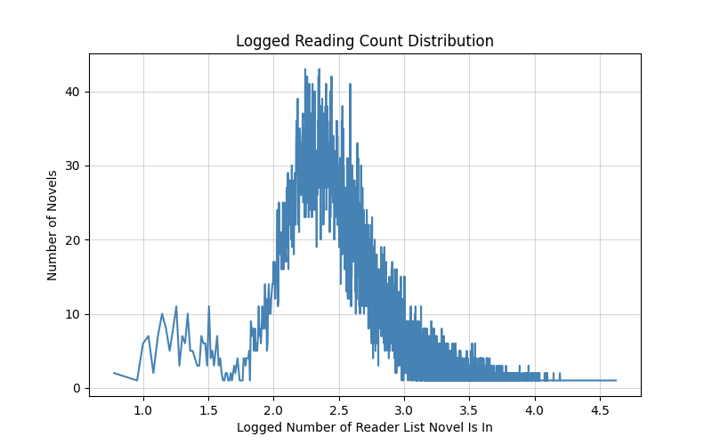
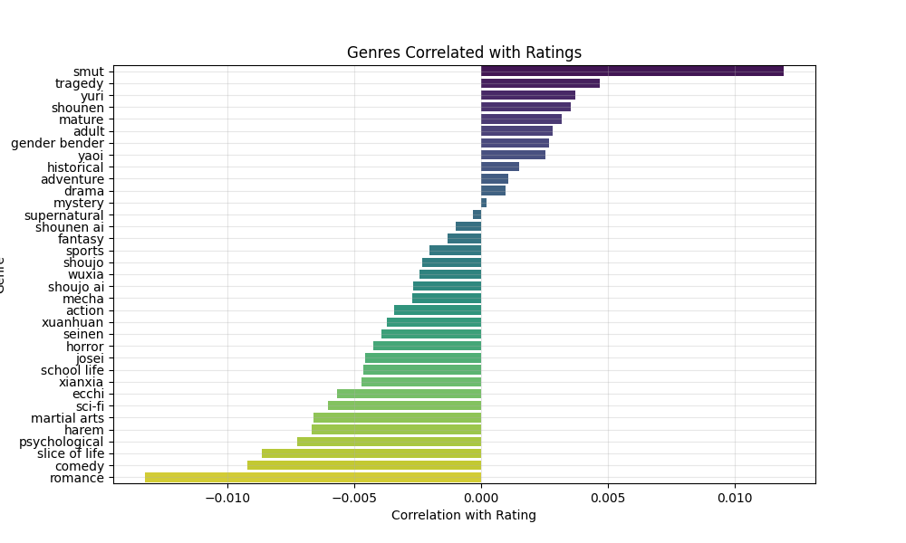

# EDA Summary

## Why This Dataset?

I choose this dataset as its one of the few publicly available datasets regarding a web novel aggregation site. Most other related datasets pertain to the actual content on web novels with chpater content. This dataset in particular provides some user interactions through recommendation lists and ratings with NovelUpdates tagging feature.

## Dataset Details

- Dataset From [shaido987 (Github)][shaido987_link]
    - Scrapped From [NovelUpdates][novel_updates_link]
    - Subset of 24,639 Novels 
- [NovelUpdates][novel_updates_link]
    - Aggregating site that provide summaries of Asian novels and links to other sites hosting translations
    - Provides users with ability to creating reading and recommended list
    - Comprehensive genre and tagging features 

### Structure

---

- Identifiers: id, name, cover-url (unique fields)
- Metadata: novel_type, original language, authors, start_year, original_publisher
- Categorical descriptors: genres, tags
- User engagement: rating, rating_votes, on_reading_lists, recommendation_list_ids
- Translation info: complete_original, complete_translated, chatpers_original_current, release_freq
- Relational data: related_series_ids, recommended_series_ids
- Novel update ranking metrics: activity_week_rank, activity_month_rank, activity_all_time_rank, reading_list_all_time_rank

## EDA Results

### Data Quality

---

#### Data Issues

```
Ratings Ranges From (0 - 36,548)
```

- Verified on [NovelUpdates][novel_updates_link] that actual ratings go from 1 to 5. Found 21 ratings over 5 and that novels with no ratings are recorded as a rating of 0. 

- Sparsity Issue:
    - Completed Translation: Has no real value only contains null and false
    - English Publisher: Is very sparse, essentially almost all novels have no english publisher

```
Negative Reading List Range From (-14 - 41887)
```

- Only a single negative reading list count of -14, but there appears to be a cutoff value as the minimum count ignoring the negative outlier is 6.

- Release year: Inconsist formats (year, day/month/year), duplicates (webnovel release year and light novel release year), and incorrect dates (> present date).
- Authors: Is not appropiate to be used since it includes translated names, and they are indistinguishable from another author in this context without interpretting them
- Nove update ranking metrics: Inconsistent and out of date, so they will not be used. It appears on all the rankings a spike at the ranking 2000

### Data Distributions

---

- Rating Votes: Normal distribution with log scaling on number of ratings


- On Reading Lists Count: Normal distribution with log scaling on number of reading lists




- Correlation on Genres to Ratings:



### Potential Signals

---

- Recommended list ids: Can be a strong source of signal we can rebuild parts of a user recommended list and find similar novels they recommend
- Ratings and Ratings_vote: Can be an explicit signal of user preferances
- On Reading List: Can be a indicator of popularity 
- Genres: Another signal for a more content based approach
- Tags: Looking into TF-IDF analysis on them since some novels contains lots of tags and we should reduce these tags to the most important

[novel_updates_link]: https://www.novelupdates.com
[shaido987_link]: https://github.com/shaido987/novel-dataset