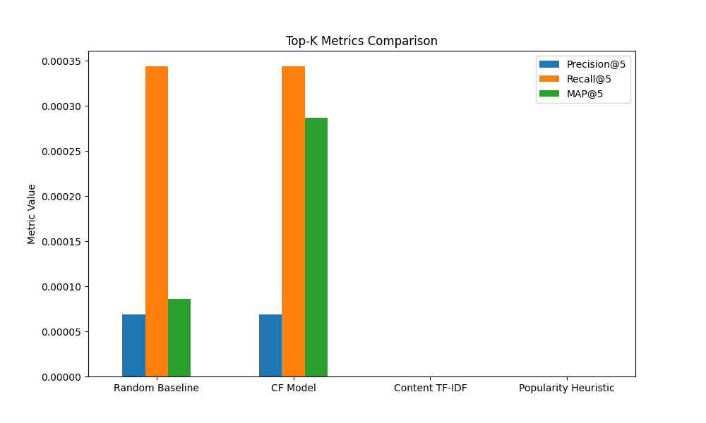
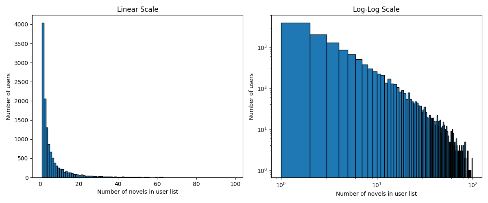

# First Draft Report

## Dataset And Features

### Data Used

- Novel Metadata As Features: 
    - genres
    - tags
    - Original_language
    - On_reading_lists
    - recommendation_list_ids

### Preprocessing

- Preprocessing
    - Tags and genres normalized and processed through TF-IDF
    - Reconstructed recommendation lists through recommendation_list_ids for CF

### Features Used

- Used TF-IDF vectors on tags and genres
- Popularity Heuristic through on_reading_list value
- Created an interaction matrix derived from recommendation lists

## Models And Evaluation

### Models Implemented

1. Random Baseline: Randomly Recommend Any Novel
2. Collaborative Filtering: Matrix factorization on user recommendation lists
3. Content-based TF-IDF: Calculate similarity scores from tags and genres TF-IDF vectors
4. Popularity Heuristic: Recommendes novels with high on_reading_lists count with filtering on primary_language

### Evaluation

Even after repeated runs, only the random baseline and cf consisted had any positive metric score. However, CF consistently outperforms random baseline. In this case, it shares similar eval for Precision@K and Recall@K, but CF MAP@K is much greater. 

### Interpretation

The consistly low scores for all models (below 0.01) indicated the extreme sparsity issue. However, CF's consistent performance indicated that recommendation lists are a strong signal. Looking purely at the sets sizes, there is only ~ 84K interactions with 24K items and ~12K users. 

The power law distribution of recommendation list size and count shows that a majority of users contribute very little with most lists consisting of 1-2 novels and very few contributing large sets of novels capping at 99 novels. With the majority of recommendation lists being so small makes Top-K metrics challenging since K is often times larger than the entire recommendation list. 

### Pros And Cons Of CF

CF strengths
- Effectively draws on the strongest signal; recommendation_lists
- Was able to get some effective recommendations even in the extremely sparse system

CF weakness
- Cold start problem: New users won't get good recommendation
- Novels without any recommendations won't get recommended

### Future Ideas For Improvement

- Look into synthetic data generation techniques to address sparsity issue
- Combining techniques, i.e., hybrid approach with CF
- Explore more features like rating/rating_votes for heuristics
- Hyperparameter tuning
